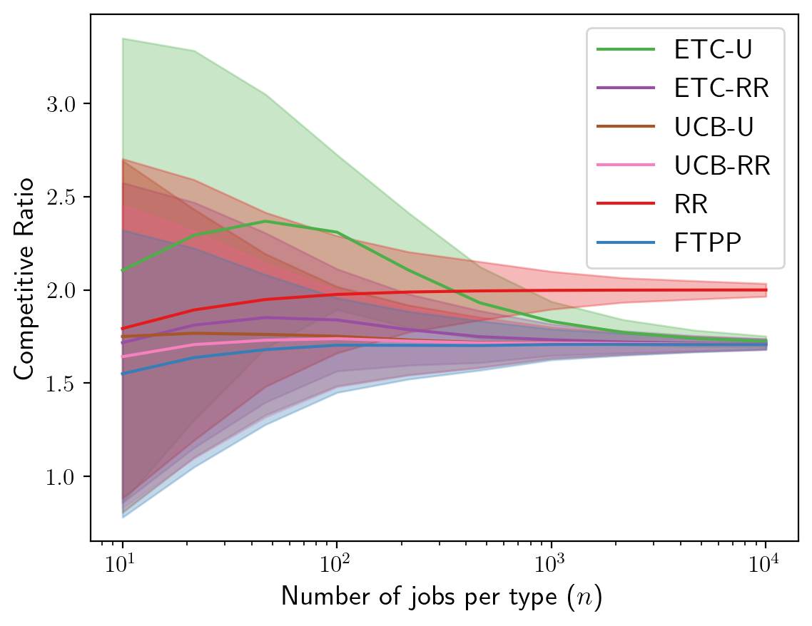
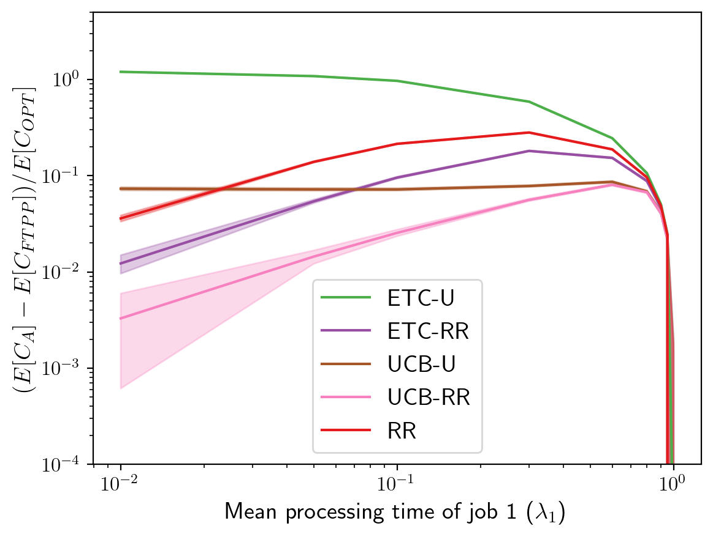
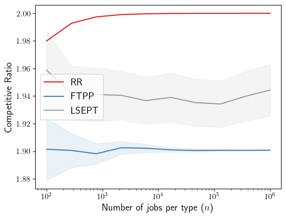

# ml4a-scheduling
Code accompanying our ICML 2023 submission

## Install 

Go in the `ml4a-scheduling` directory.
After required dependency are installed (via `pip install -r requirements.txt`) run:

`pip install -e .`

## Requirements

For the core algorithms:

- numpy>=1.16
- scipy>=1.3.2
- numba >= 0.56.4

To reproduce and plot the experiments (Figures 1, 2 and 3).

- matplotlib>=2.0.0
- joblib>=1.2.0

To run the tests:

- pytest>=5.0.1

To install all requirements, go in the `ml4a-scheduling` directory and run
`pip install -r requirements.txt`

## Experiments

### Scheduling 2 groups of a varying number of jobs with fixed expected job processing time (Figure 1)
Go in the `experiments` directory.

Run `python all_algos-vary-nsamples.py`

Go in the `plotting` directory.

Run `python plot_all_algos-vary-nsamples.py`

See the figure in `figures/all_algos_vary_nsamples.pdf`.

### Scheduling 2 groups of n=50 jobs with varying expected job processing time (Figure 2)
Go in the `experiments` directory.

Run `python n_50_vary_lambda_logscale.py`

Go in the `plotting` directory.

Run `python plot_n_50_vary_lambda_logscale.py`

See the figure in `figures/n_50_vary_lambda_logscale.pdf`.

### Benchmark LSEPT with 2 groups of a varying number of jobs with fixed expected job processing time (Figure 3)
Go in the `experiments` directory.

Run `python nsamples_lsept.py`

Go in the `plotting` directory.

Run `python plot_vary-nsamples_lsept.py`

See the figure in `figures/vary-nsamples_lsept.pdf`.

