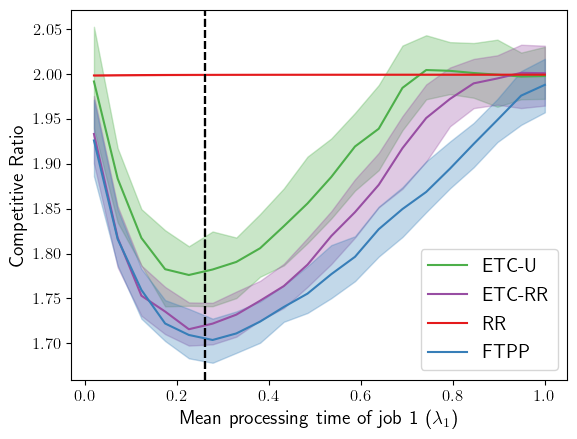
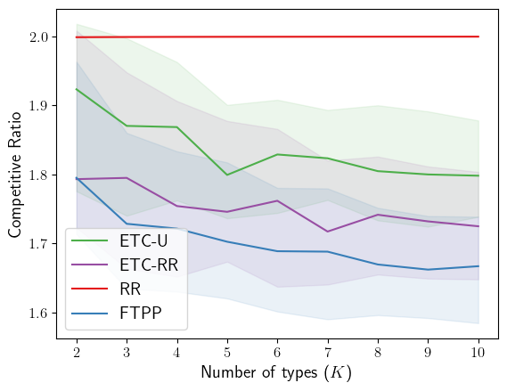
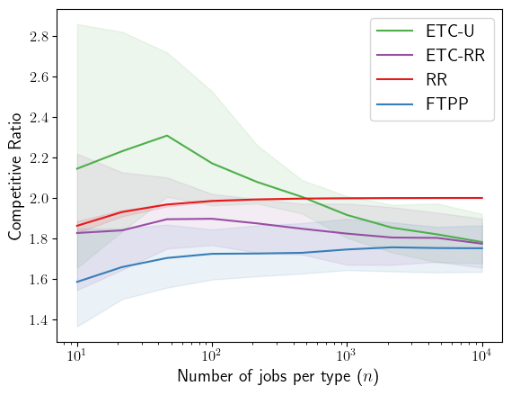
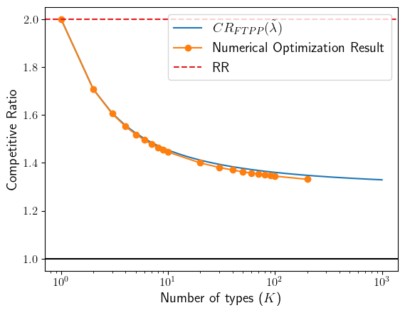

# ml4a-scheduling
Code accompanying our NeurIPS 2022 submission

## Install 

Go in the `ml4a-scheduling` directory.
After required dependency are installed (via `pip install -r requirements.txt`) run:

`pip install -e .`

## Requirements

For the core algorithms:

- numpy >= 1.16

To reproduce Figure 1 and 2:

- numpy >= 1.16
- joblib >= 1.0.0
- matplotlib >= 2.0.0 

To reproduce Figure 3:

- numpy >= 1.16
- scipy >= 1.3.2
- matplotlib

To install all requirements, go in the `ml4a-scheduling` directory and run
`pip install -r requirements.txt`

## Experiments

### Scheduling 2 groups of n=2000 jobs with varying expected size (Figure 1)
Go in the `experiments` directory.

Run `python etc_vs_opt-2-jobs.py` (Running time (total): 17.549s)

Go in the `plotting` directory.

Run `python plot_etc_vs_opt-2-jobs.py`

See the figure in `figures/etc-vs-opt-2-jobs.pdf`.

### Scheduling k groups of n=2000 jobs with uniform expected size where k varies (Figure 2, Left)
Go in the `experiments` directory.

Run `python etc_vs_opt-k-jobs-uniform.py` (Running time (total): 5.3min)

Go in the `plotting` directory.

Run `python plot_etc_vs_opt-k-jobs-uniform.py`

See the figure in `figures/etc-vs-opt-k-jobs-uniform.pdf`.

### Scheduling k=3 groups of n jobs with uniform expected size where n varies (Figure 2, Right)
Go in the `experiments` directory.

Run `python etc_vs_opt-vary-nsamples.py` (Running time (total): 21.920s)

Go in the `plotting` directory.

Run `python plot_etc_vs_opt-vary-nsamples.py`

See the figure in `figures/etc-vs-opt-vary-nsamples.pdf`.

### Minimum of the CR with k groups of n jobs as n goes to infinity (Figure 3)
Go in the `experiments` directory.

Run `python asymptotic-cr-numerical-optimization.py` (Running time (total): 2.5min)

Go in the `plotting` directory.

Run `python plot_asymptotic_cr.py`

See the figure in `figures/asymptotic-cr.pdf`.

